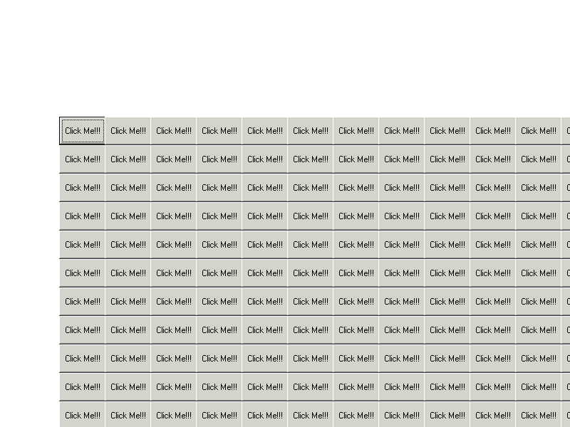



## A "Button" Form

### Description

It starts off as 1 "click me" button in the middle of screen, when you click it 3 more come up, when you clickit three more come up,ect...untill you find your way out.I'm fairly new so please dont criticize My code. Though there is 900+ lines of code.
 
### More Info
 

             |
---                |---
**Submitted On**   |2005-06-25 22:14:22
**By**             |[Ryan Spencer](https://github.com/Planet-Source-Code/PSCIndex/blob/master/ByAuthor/ryan-spencer.md)
**Level**          |Beginner
**User Rating**    |4.2 (21 globes from 5 users)
**Compatibility**  |VB 6\.0
**Category**       |[Jokes/ Humor](https://github.com/Planet-Source-Code/PSCIndex/blob/master/ByCategory/jokes-humor__1-40.md)
**World**          |[Visual Basic](https://github.com/Planet-Source-Code/PSCIndex/blob/master/ByWorld/visual-basic.md)
**Archive File**   |[A\_\_Button\_1906446282005\.zip](https://github.com/Planet-Source-Code/ryan-spencer-a-button-form__1-61380/archive/master.zip)

